# Car Repair Service
The Car Repair API enables users and applications to easily keep track of car reparations. An employee will work on a customer's car while using a part of a certain category. An employee has a function/position within the company. Their working hours will also be logged.

#### Architecture
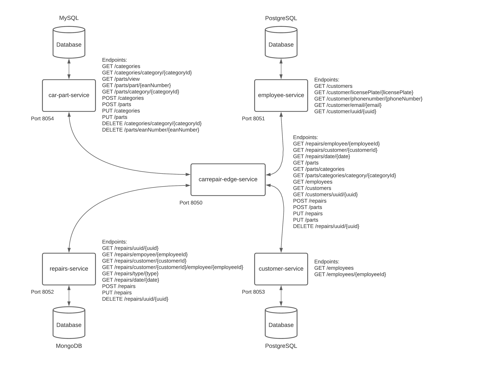

#### Team Members
[Dries Bierens](https://github.com/driesbierens),
[Aiman Abdulsalam](https://github.com/r0746124),
[Wout Renkin](https://github.com/Wout-Renkin),
[Seppe Alaerts](https://github.com/alaertsseppe)

#### Microservices
Repairs:    https://github.com/driesbierens/repairs-service

Parts:      https://github.com/r0746124/car-part-service

Customers:  https://github.com/alaertsseppe/customer-microservice

Employees:  https://github.com/Wout-Renkin/employee-microservice

#### Frontend Angular Application
https://github.com/r0746124/auto-service

#### Swagger calls
##### GET all Customers (/customers)
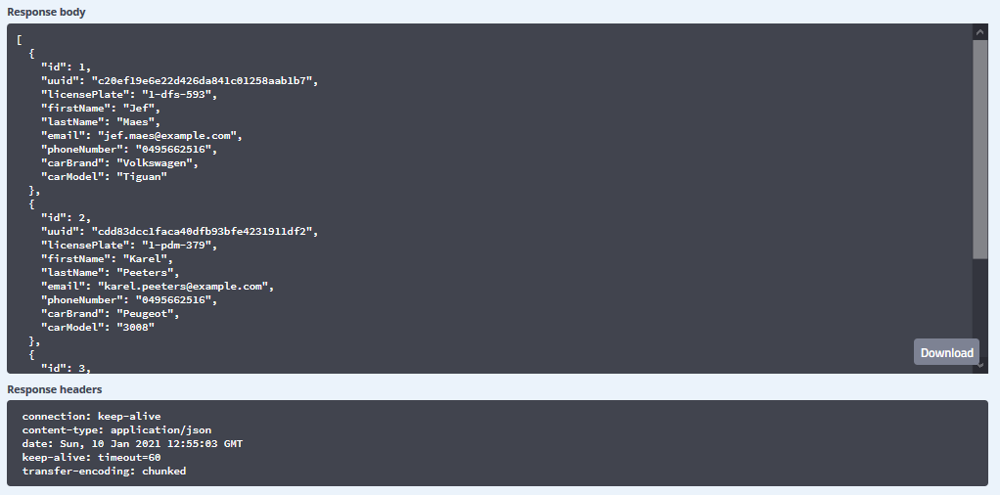
##### GET Customer by Uuid (/customers/uuid/{uuid})
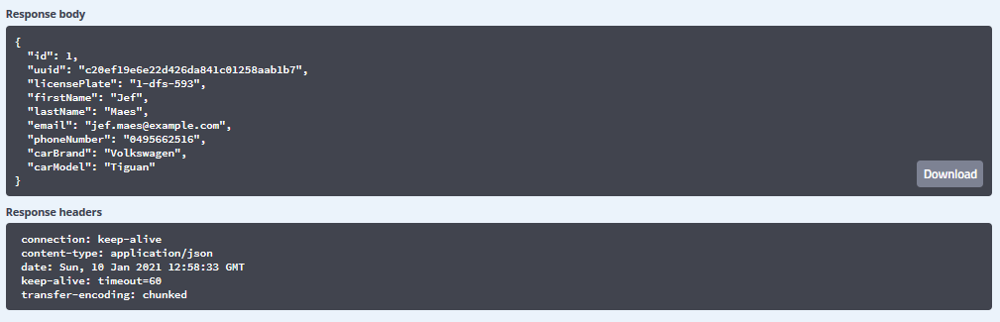
##### GET all Employees (/employees)
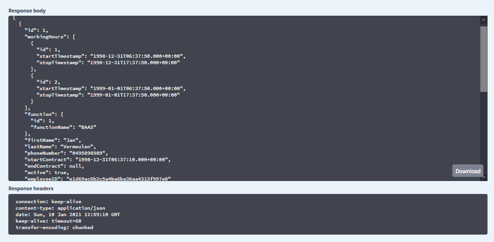
##### GET all Parts (/parts)
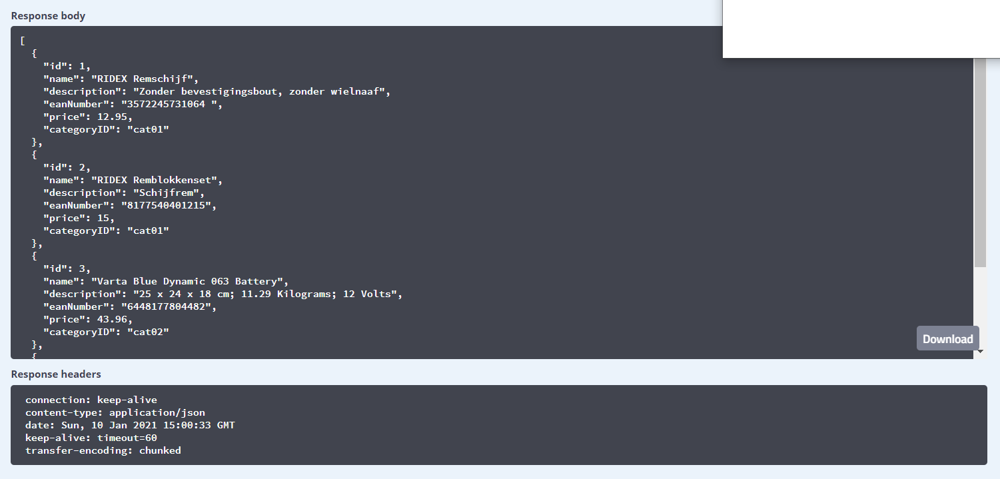
##### POST part (/parts)
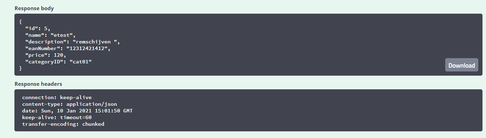
##### PUT part (/parts)
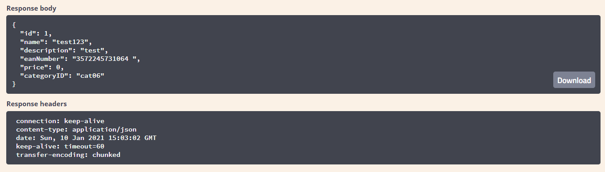
##### GET all Categories (/parts/categories)
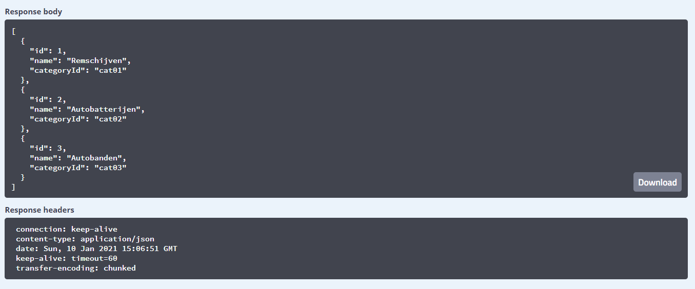
##### GET Category by Id (/parts/categories/category/{categoryId})
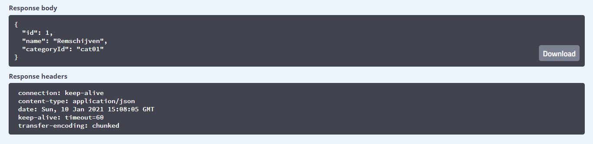
##### POST Repair (/repairs)

##### PUT Repair (/repairs)

##### GET Repairs by CustomerId (/repairs/customer/{customerId})
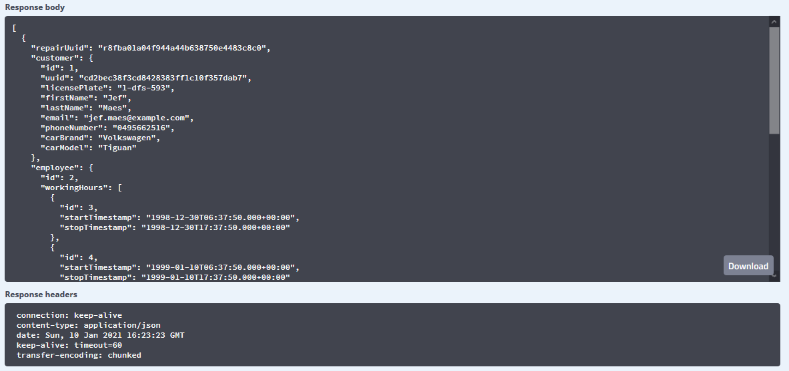
##### GET Repairs by Date (/repairs/date/{date})
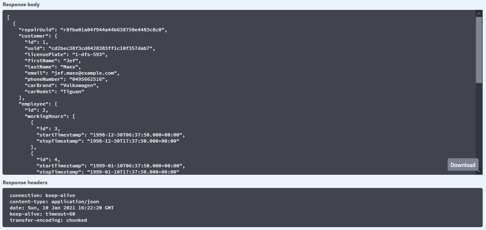
##### GET Repairs by EmployeeId (/repairs/employee/{employeeId})
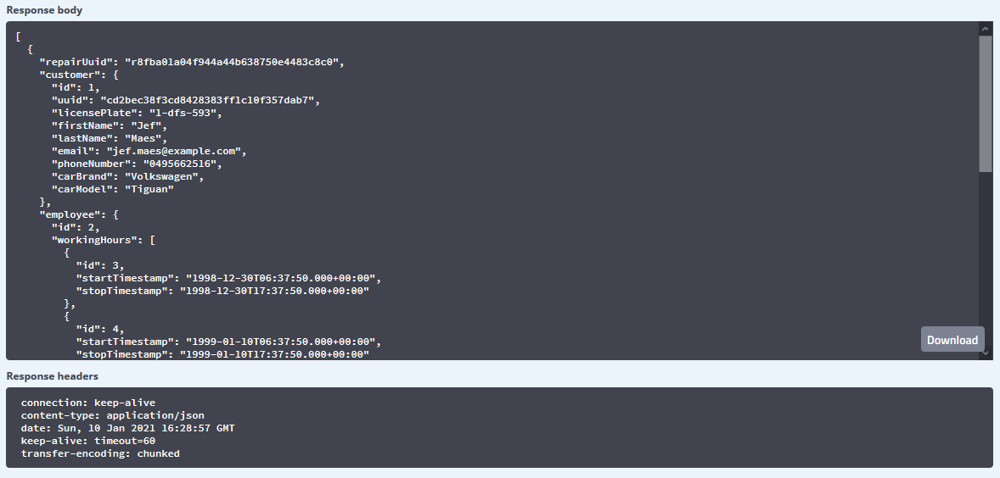
##### DELETE Repair by Uuid (/repairs/uuid/{uuid})
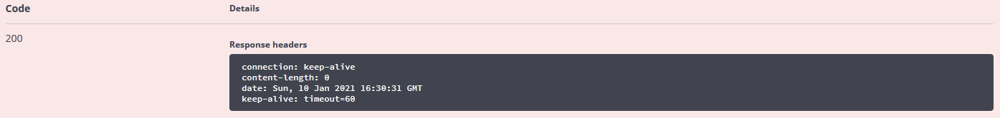